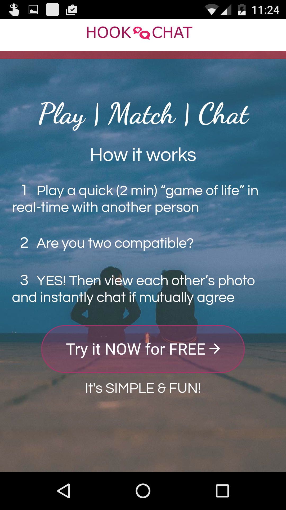
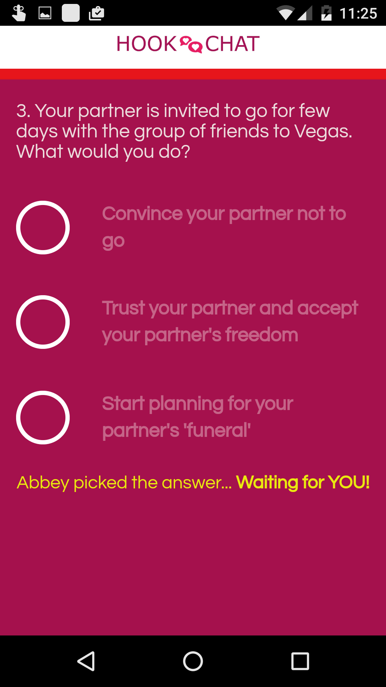
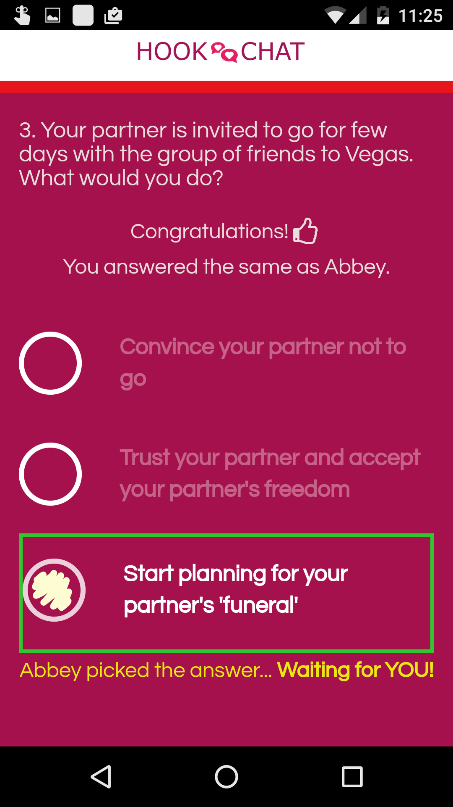
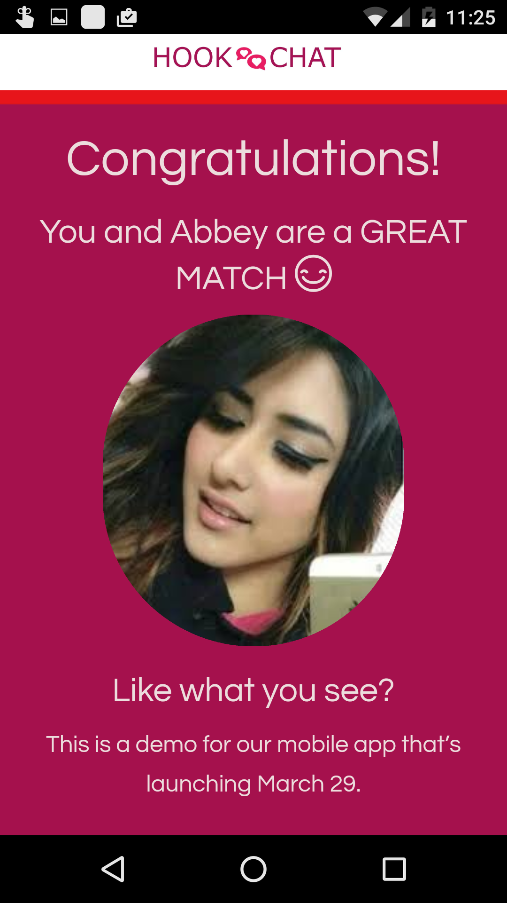
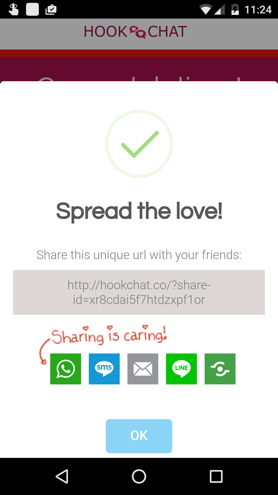

# Hookchat
Landing page &amp; [smoke test](http://www.inc.com/ilya-pozin/how-to-validate-your-start-up-idea.html) for HookChat - www.hookchat.co

32% conversion rate of people that entered the funnel by pressing the "Try it now for FREE" button and then went on and gave us their email to get early access to the app.

Actual app available at: www.finchzee.com

###Home
---

###Getting started
---

###Q&A
---

###Q&A - matched answers
---

###It's a match
---

###Get email
---

##Mobile friendly

###Home
---

###Q&A
---

###Q&A - matched answers
---

###It's a match
---

###Get email
---

###Share
---

**Built with:**
 - Angular
 - Bootstrap
 - jQuery
 
**Components:**
 - SVG Checkbox - http://tympanus.net/Development/AnimatedCheckboxes/
 - Wow - https://github.com/matthieua/WOW
 - SweetAlert - http://t4t5.github.io/sweetalert/
 - Loaders - https://github.com/lukehaas/css-loaders
 - Shareaholic - https://shareaholic.com/

Built opon the Landing Zero Theme - https://www.bootstrapzero.com/bootstrap-template/landing-zero-free-bootstrap-theme
